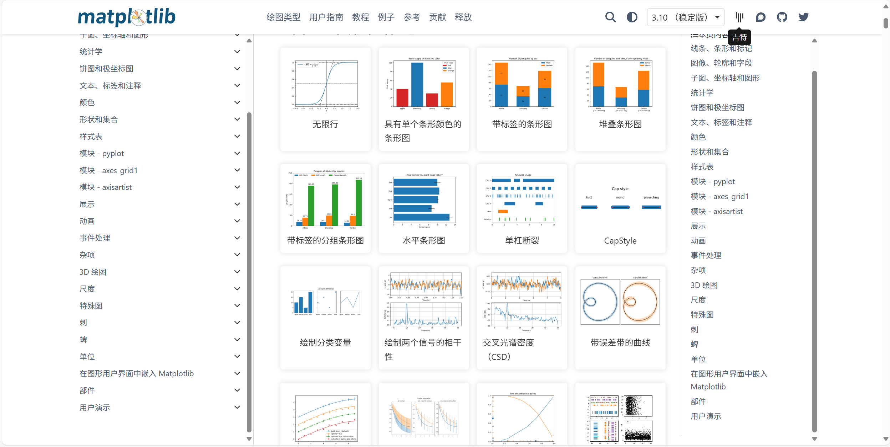
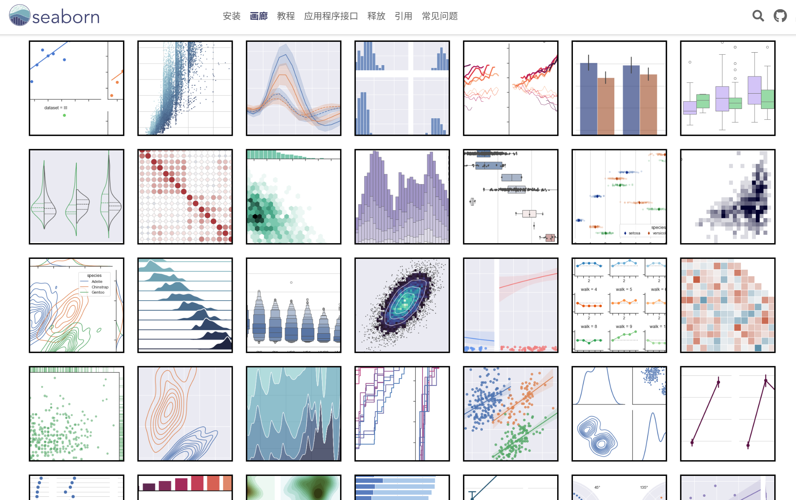

# 探索数据可视化

有好几个库都可以进行数据可视化。用 matplotlib 和 seaborn 对本次中涉及的 Pumpkin 数据集创建一些数据可视化的图标。并思考哪个库更容易使用？

## 评判标准

| 标准 | 优秀 | 中规中矩 | 仍需努力 |
| -------- | --------- | -------- | ----------------- |
|          | 提交了含有两种探索可视化方法的 notebook 工程文件         |   提交了只包含有一种探索可视化方法的 notebook 工程文件       |  没提交  notebook 工程文件                 |

-------------
  
    
# <center> matplotlib 和 seaborn </center>


| matplotlib | seaborn |
| -------- | --------- |
| |  |
|||
|[matplotlib官方示例图库链接地址](https://matplotlib.org/stable/gallery/index.html)|[seaborn官方示例图库链接地址](https://seaborn.pydata.org/examples/index.html)|

##  <center>Matplotlib 和 Seaborn 的核心对比</center>
>**Matplotlib** 是**基础工具**，适合需要精确控制的专业场景。**Seaborn** 是**效率工具**，适合快速生成统计图表的数据分析场景。
### Matplotlib："所见即所得"
Matplotlib 是 Python 生态中最基础的可视化库，提供了类似 MATLAB 的绘图接口，支持 2D/3D 图表、交互式界面和打印输出。它通过 `figure` 和 `axes` 等对象层次结构，实现对图表元素的精细控制。"所见即所得"，**追求对图表每个细节的精确控制**。适合需要自定义图表外观、开发交互式应用或生成学术出版物级图表的场景。

**优点** 
| **高度灵活** |**广泛支持** |**社区成熟**|
| -------- | --------- | -------- | 
|可自定义图表的几乎所有元素（颜色、字体、线条样式等|兼容 NumPy、Pandas 等多种数据结构，支持多种后端（如 Tkinter、Qt）|文档完善，社区资源丰富，多数可视化库基于其开发|

**缺点**  
| **代码冗长** |**样式陈旧** |**学习曲线陡峭**|
| -------- | --------- | -------- |
|基础图表也需较多代码实现|默认样式不符合现代审美，需手动调整|需理解 `figure`、`axes`、`subplots` 等多层概念|


### Seaborn："用最少的代码，生成最美观的统计图表"
Seaborn 是基于 Matplotlib 的高级统计可视化库，专注于展示数据分布、关系和统计模型。它**简化**了复杂**图表的创建过程**，提供**更美观的默认样式和配色方案**。"用最少的代码，生成最美观的统计图表"。通过封装 Matplotlib 的底层 API，提供简洁的接口用于探索性数据分析和统计可视化。

**优点**  
| **简洁易用** |**美观默认值** |**统计友好** |**数据感知**|
| -------- | --------- | -------- | ----------------- | 
|一行代码实现复杂统计图表（如箱线图、热力图、回归图）|默认样式符合现代设计标准，配色方案专业|内置多种统计模型和分析方法，自动计算置信区间等|直接接受 Pandas DataFrame，支持按列分组绘图|

**缺点**  
| **定制受限** |**功能局限** |**性能问题** |
| -------- | --------- | -------- |
|复杂图表仍需调用 Matplotlib 进行深度定制|专注统计可视化，不支持复杂交互或非统计类图表|处理超大规模数据集时效率较低|

## 示例

|Seaborn|Matplotlib|
| -------- | --------- |
|||
|||


## 自定义问题和结果
1. 哪些州的南瓜产量最多？不同地区的生产情况如何？哪些是地区特色/优势？
2. 哪里的南瓜价格最高？
3. 南瓜的大小与价格有何关系？
4. 哪种南瓜最贵？最便宜？
5. 不同月份的南瓜价格如何变化？南瓜市场上的不同类型南瓜数量如何变化？
6. **建立价格预测模型，预测南瓜价格**

产量最多的州: MICHIGAN，产量为227
价格最高的城市: BOSTON，均价为174.25
最贵的南瓜尺寸: xlge，均价为194.98
最贵的南瓜品种: BLUE TYPE，均价为226.71
价格最高的月份: 7.0月，均价为252.00
从各月份南瓜价格变化，1-7月份均价逐渐上升，8-12月份逐渐下降，说明南瓜市场在1-7月份需求量较大，8-12月份需求量较小。

## 预测模型  
```
模型: LinearRegression
均方误差 (MSE): 1401.27
平均绝对误差 (MAE): 23.31
决定系数 (R²): 0.79
--------------------------------------------------
模型: Ridge
均方误差 (MSE): 1401.75
平均绝对误差 (MAE): 23.31
决定系数 (R²): 0.79
--------------------------------------------------
模型: Lasso
均方误差 (MSE): 1393.78
平均绝对误差 (MAE): 23.18
决定系数 (R²): 0.79
--------------------------------------------------
模型: RandomForestRegressor
均方误差 (MSE): 281.31
平均绝对误差 (MAE): 8.17
决定系数 (R²): 0.96
--------------------------------------------------
模型: GradientBoostingRegressor
均方误差 (MSE): 3389.74
平均绝对误差 (MAE): 46.38
决定系数 (R²): 0.49
--------------------------------------------------
表现最好的模型: RandomForestRegressor
```
