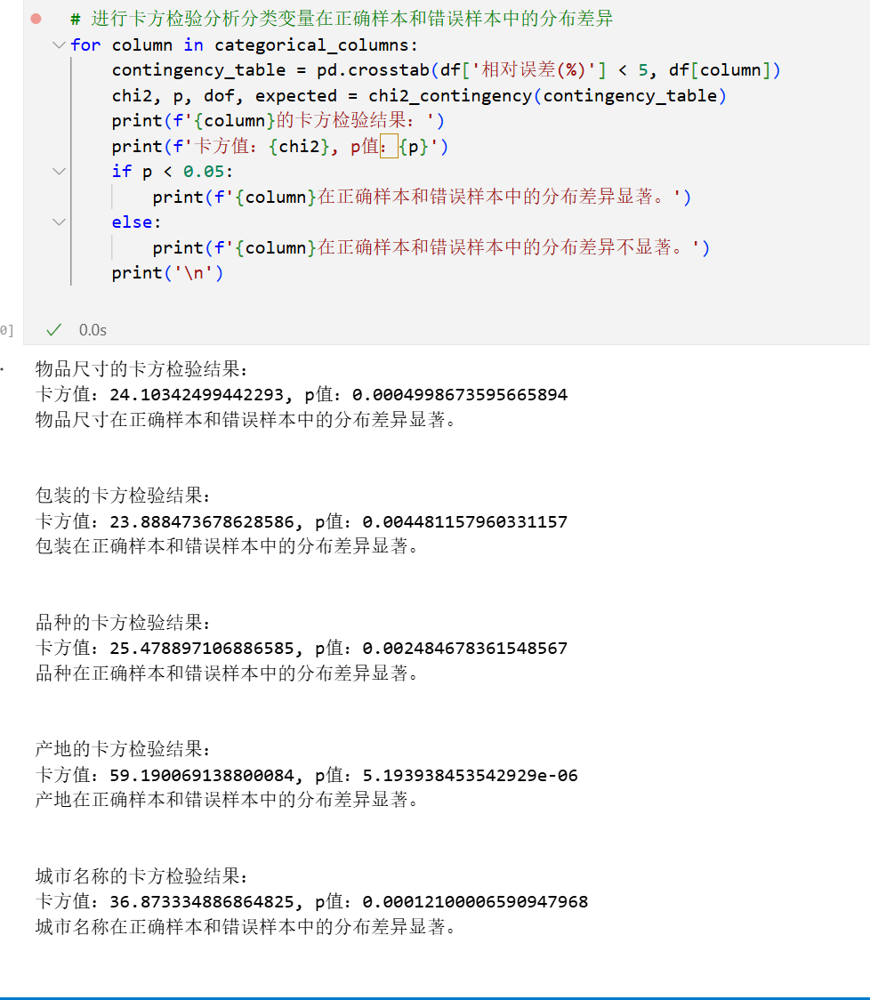
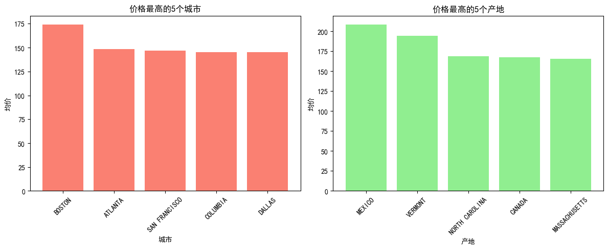

### 一、项目结构和简单介绍

#### 项目结构

```
作业四/
├── data/
│   └── US-pumpkins.csv
├── scripts/
│   ├── Data_EDA.py
│   ├── data_tezheng.py
│   ├── main.py
│   ├── model.py
│   └── show_jieguo_fx.py
└── models/
└── image/
└──Week4-readme.md
```

#### 简单介绍

- **data 文件夹**：存放项目所需的数据集，这里是 `US-pumpkins.csv` 文件，包含了南瓜相关的数据。
- **scripts 文件夹**：包含多个 Python 脚本文件，用于数据处理、模型训练和结果可视化等任务。
  - `Data_EDA.py`：进行数据探索性分析，包括数据概况展示、自动 EDA 等功能。
  - `data_tezheng.py`：对数据进行特征处理，如列名重命名、日期处理、缺失值填充、特征选择等。
  - `main.py`：项目的主程序，负责加载数据、调用模型训练和评估函数。
  - `model.py`：定义了模型管道、模型列表、指标计算和模型保存等函数。
  - `show_jieguo_fx.py`：用于绘制各种可视化图表，如实际值 vs 预测值图、特征重要性图等。
- **models 文件夹**：用于保存训练好的模型和相关的评估结果。
- image：用于存放可视化图表的图片文件。
- **Week4-readme.md**：项目的说明文档,问题回答等

### 二、DAY 2

#### （1）使用第一天的代码跑完 LGBM 和 XGBoost 模型

在 `main.py` 中，`run_all_list_models` 函数会遍历 `get_model_list` 函数返回的所有模型，包括 LGBM 和 XGBoost 模型。直接运行 `main.py` 即可完成这两个模型的训练和评估。

```python
if __name__ == '__main__':
    main()
```

#### （2）提交实验结果

运行 `main.py` 后，每个模型的详细评估结果会保存到 `models` 文件夹下对应的模型目录中，同时汇总结果会保存到 `models/model_summary_results.csv` 文件中。

* 具体的各个模型的每次的结果评价在每个模型文件夹下的 results文件，如图为GradientBoostingRegressor的展示

  

#### （3）实验结果汇总

`models/model_summary_results.csv` 文件包含了所有模型的汇总评估结果，包括 R²、RMSE、MAE 和 MAPE 的均值和标准差。


#### （4）单轮实验和样本分析
以`LGBR`为例，在`models/LGBMRegressor_20250719`文件夹下，有`LGBMRegressor_20250719_predictions.csv`，

|||||
|:--------------:|:-----------:|:-------------:|:------------:|

**分类变量分析**
通过卡方检验，我们发现`物品尺寸`、`包装`、`品种`、`产地`和`城市名称`这些分类变量在正确样本（相对误差小于 5%）和错误样本（相对误差大于等于 20%）中的分布差异都是显著的（p 值均小于 0.05）。这意味着这些变量与预测误差的大小有着紧密的联系。

**连续变量分析**
通过 t 检验，`月份`和`星期`这两个连续变量在正确样本和错误样本中的均值差异不显著（p 值均大于 0.05）。这表明从整体上看，这两个变量单独对预测误差的影响较小。
- 这里和后面的shap的分析结果相同，重要特征主要还是分类变量，月份不再前列。

##### 样本组分析
从正确样本和错误样本中各选取 2 组数据，结合数据中的各个特征来深入分析其预测误差产生或较小的原因。

```  样本类型  月份  星期 物品尺寸                   包装           品种            产地  \
2  正确样本 1  10   5  sml         24 inch bins     PIE TYPE  PENNSYLVANIA   
3  正确样本 2  10   5  jbo         36 inch bins  HOWDEN TYPE      MICHIGAN   
5  错误样本 1  10   5  med  1 1/9 bushel crates    MINIATURE      NEW YORK   
9  错误样本 2   8   5  med          50 lb sacks   CINDERELLA       FLORIDA   

        城市名称    实际值         预测值     相对误差(%)  
2     BOSTON  175.0  172.523793    1.414975  
3     BOSTON  175.0  180.891037    3.366307  
5   NEW YORK   18.0   65.312484  262.847133  
9  BALTIMORE   29.0    7.466631   74.252996
```
|||
|:--------------:|:-----------:|
* *结合Data_EDA.py等图片以及手动筛选分析，此处仅仅展示部分图表*
**正确样本 1**
 - **时间因素稳定**：10 月的第 5 个星期，这个时间段是南瓜出产季节，南瓜种类多，销售记录丰富，有助于模型准确预测。该类物品的市场供需相对稳定，没有出现大的波动，使得预测较为准确。
 - **特征组合熟悉**：小尺寸（sml）、特定包装（24 inch bins）、PIE TYPE 品种的组合，可能在过往的数据中有较多的记录，模型对这种常见的特征组合学习充分，从而能够准确预测。

**正确样本 2**
 - **时间规律延续**：和样本 1 同属 10 月的第 5 个星期，延续了该南瓜出产时间段稳定的市场特点，南瓜种类多，销售记录丰富，有助于模型准确预测。
 - **区域市场稳定**：BOSTON 城市中多种南瓜的价格区间比较稳定，对应预测难度，误差就会较小

**错误样本 1**
 - **时间特殊影响**：尽管还在生产旺盛季节11 月，但是可能存在一些特殊的市场因素，比如临近某些节日促销、季节转换导致消费需求变化，而模型没有充分考虑到这些特殊情况。
 - **包装因素干扰**：1 1/9 bushel cartons 这种包装可能比较特殊，在运输、存储或销售过程中有不同于常见包装的情况，影响了产品的实际销售情况，而模型对这种包装的影响学习不足。

**错误样本 2**
 - **本地市场复杂性**：虽然产地和城市都是 NEW YORK，样本数量在前列，但本地市场可能存在复杂的竞争关系、消费者偏好变化等因素，导致相似南瓜的价格区间大，模型难以学习，预测困难。
>个人总结：天时地利人和，模型才能准确预测，而天时地利人和中，天时主要是生产旺季，特定时间节点的影响，相对简单，直接影响度低，但是可能间接在季节时令影响南瓜生产/销售的数据记录（训练数据） 的多与少，从而影响模型效果；而人和因素影响最大，即市场供需、消费者偏好等，这些因素（对应包装，大小等）往往难以被模型捕捉，导致预测误差较大。

### 三、DAY 3

#### （1）随机森林，随机选一颗树，提交树结构

在 `show_jieguo_fx.py` 中的 `plot_tree_visualization` 函数会绘制随机森林的第一棵完整树，并保存为 PNG 文件。运行 `main.py` 后，在对应的模型目录下的 `plots` 文件夹中可以找到 `RandomForestRegressor_single_tree_complete.png` 文件。
 

#### （2）解释从树根到叶子节点的分支含义

**选择一份树根到叶子节点的分支进行解释：**
根节点 -> 左子树分支：
根节点条件：mean_包裹1/2_bucket_count <= 0.5，条件为真（True），进入左子树。   ->     左子树内部节点条件：mean_包裹1/9_bucket_count <= 0.5，条件为真（True），继续进入左子树。   ->     下一级内部节点条件：mean_城市名称_BOSTON <= 0.5，条件为真（True），继续进入左子树。   ->     再下一级内部节点条件：mean_品种_FAVORITE <= 0.5，条件为真（True），继续进入左子树。   ->     叶节点：到达叶节点，预测值 value = 320.99。
含义解释
这条分支的含义是：
首先，模型检查样本的 mean_包裹1/2_bucket_count 特征值是否小于等于0.5。如果满足这个条件，说明该样本在“包裹1/2_bucket_count”这个指标上处于较低水平。
接着，对于满足上述条件的样本，模型进一步检查 mean_包裹1/9_bucket_count 特征值是否小于等于0.5。若满足，表明样本在“包裹1/9_bucket_count”指标上也处于较低水平。
然后，对于同时满足前两个条件的样本，模型检查 mean_城市名称_BOSTON 特征值是否小于等于0.5。这可能意味着样本与“BOSTON”城市的关联程度较低
之后，对于满足前三个条件的样本，模型检查 mean_品种_FAVORITE 特征值是否小于等于0.5。若满足，说明样本在“FAVORITE”品种相关指标上处于较低水平。
当样本满足这一系列条件后，模型最终给出的预测值为 320.99

###### SHAP可视化解释模型

|  |  |
| :---------------------------------------------------------------------------------------------------: | :-------------------------------------------------------------------------------------------------------: |

要分析这张**RandomForestRegressor的SHAP值分布图**，我们需要从**特征重要性、特征值对模型输出的影响方向、特征内部差异**三个维度展开，结合SHAP图的核心逻辑（SHAP值表示特征对模型输出的“边际贡献”，红色代表高特征值、蓝色代表低特征值）进行解读：

###### 1. 特征重要性：谁在模型中“话语权”最大？

SHAP值的**分布宽度**（即点的分散程度）反映特征对模型的影响程度：分布越宽，特征越重要。

- 图中**顶部特征**（如 `nom_包装_1 1/9 bushel cartons`、`nom_包装_1/2 bushel cartons`、`nom_城市名称_BOSTON`、`nom_品种_MINIATURE`等）的SHAP值分布最分散，说明这些特征是模型预测的**核心影响因子**。
- 图中**底部特征**（如 `nom_城市名称_DALLAS`、`nom_城市名称_CHICAGO`等）的SHAP值分布较窄，对模型的影响相对较弱。

###### 2. 特征值的影响方向：“高值/低值”如何影响预测？

通过颜色（红=高特征值、蓝=低特征值）和SHAP值的正负（横轴，正=促进输出、负=抑制输出），可判断特征值对模型的作用：

- **包装类特征**（如 `nom_包装_1 1/9 bushel cartons`、`nom_包装_1/2 bushel cartons`）：红色点（高特征值）的SHAP值多分布在**正区间**（横轴右侧），说明“高包装规格”会**促进模型输出**（如预测价格/销量升高）；蓝色点（低特征值）的SHAP值多在**负区间**（横轴左侧），说明“低包装规格”会**抑制模型输出**。
- **城市类特征**（如 `nom_城市名称_BOSTON`）：红色点（高特征值，可理解为“该城市的某种编码为高”）的SHAP值为正，说明“波士顿”这类城市的取值会**促进模型输出**；其他城市（如 `nom_城市名称_LOS ANGELES`）的SHAP值既有正也有负，反映**不同城市对模型的影响方向/程度存在差异**（可能与城市的需求、供应属性相关）。
- **品种类特征**（如 `nom_品种_MINIATURE`、`nom_品种_FAIRYTALE`）：红色点的SHAP值多为正，说明“高品种标识”（如品种的稀缺性、受欢迎程度编码）会**推动模型输出**；少数品种（如 `nom_品种_BIG MACK TYPE`）的红色点SHAP值接近0或略负，说明该品种对输出的促进作用较弱。
- **有序/时间特征**（如 `ord_物品尺寸`、`remainder_月份`）：
  `ord_物品尺寸`的SHAP值分布显示“尺寸越高（红），SHAP值越正”，反映**物品尺寸与模型输出正相关**；
  `remainder_月份`的SHAP值分布较集中，说明月份对模型的影响弱于顶部特征，但“旺季月份（红）”仍可能推动输出、“淡季月份（蓝）”抑制输出。

###### 3. 特征内部差异：同一特征的不同取值如何分化影响？

分类特征（包装、城市、品种）的**不同类别**对模型的影响存在显著分化：

- 包装类型：不同规格（如 `1 1/9 bushel cartons` vs `1/2 bushel cartons`）的SHAP分布模式不同，说明“包装规格的细微差异”会导致模型对输出的判断截然不同（可能与成本、运输效率等业务逻辑相关）。
- 城市名称：波士顿、洛杉矶、达拉斯等城市的SHAP值方向/大小差异明显，反映**城市的地域属性（如消费能力、市场供需）是模型决策的关键依据**。
- 品种类型：迷你型（MINIATURE）、童话型（FAIRYTALE）等品种的SHAP值多为正，而BIG MACK TYPE等品种的SHAP值偏中性，说明**品种的“特性标签”（如口感、产量）直接影响模型对目标变量的预测**。

参考文献：https://shap.readthedocs.io/en/latest/index.html

#### （3）推倒该棵树的生长过程

随机森林中的每棵树是通过以下步骤生长的：

1. **自助采样**：从原始数据集中有放回地随机抽取一部分样本作为当前树的训练数据。
2. **特征随机选择**：在每个节点分裂时，随机选择一部分特征作为候选分裂特征。
3. **节点分裂**：选择最佳的分裂特征和分裂阈值，将节点分裂为两个子节点，使得分裂后的子节点的纯度最高（如最小化均方误差）。
4. **递归生长**：对每个子节点重复步骤 2 和 3，直到满足停止条件（如树的最大深度、最小样本数等）。

### 四、DAY 4

#### （1）推倒 LGBM/XGBoost 的学习过程

##### LGBM 学习过程

1. **初始化**：初始化一个常数作为初始预测值。
2. **迭代训练**：
   - 计算当前模型的负梯度（即残差）。
   - 使用直方图算法构建决策树，寻找最佳的分裂点。
   - 对决策树进行剪枝，防止过拟合。
   - 将新的决策树加入到模型中，更新预测值。
3. **重复步骤 2**，直到达到指定的迭代次数或满足停止条件。

##### XGBoost 学习过程

1. **初始化**：初始化一个常数作为初始预测值。
2. **迭代训练**：
   - 计算当前模型的一阶导数和二阶导数。
   - 构建决策树，通过最大化目标函数来寻找最佳的分裂点。
   - 对决策树进行正则化，防止过拟合。
   - 将新的决策树加入到模型中，更新预测值。
3. **重复步骤 2**，直到达到指定的迭代次数或满足停止条件。

##### **其他**

- 袋装和提升是两种常见的集成学习方法，它们在训练过程中有所不同。随机森林是一种基于袋装的集成学习方法，而XGBoost和LightGBM是一种基于提升的集成学习方法。
  详细：[作业四\Bagging vs Boosting.md](/作业四/Bagging%20vs%20Boosting.md)

### 五、DAY 5

#### （1）对南瓜数据掌握的细节

- **日期信息**：在 `data_tezheng.py` 中，将日期列转换为年、月、日和星期后，删除了日期列。是因为单独的日期信息对模型的预测能力贡献不大。在前面的数据探索我们绘制了图发现日期规律不明显。
- **样本分布**：使用 `Data_EDA.py` 中的 `auto_eda` 函数分析每种种类、规格、城市和产地的样本分布。
- **五个自定义问题回答**：

|  |  |  |  |  |
| :--------------------------------------: | :--------------------------------------: | :--------------------------------------: | :--------------------------------------: | :--------------------------------------: |

1. 产量最多的州: MICHIGAN，产量为227
2. 价格最高的城市: BOSTON，均价为174.25
3. 最贵的南瓜尺寸: xlge，均价为194.98
4. 最贵的南瓜品种: BLUE TYPE，均价为226.71
5. 价格最高的月份: 7.0月，均价为252.00

#### （2）对特征处理掌握的细节

- **特征编码**：使用 `OneHotEncoder` 对名义分类特征进行编码，使用 `OrdinalEncoder` 对有序分类特征进行编码。线性模型对离散值的顺序编码非常敏感，而树模型相对较好，但也会有一定影响。
- **缺失值处理**：使用热卡填补法对 `产地` 和 `品种` 列的缺失值进行填充。
- **特征选择**：删除了一些空值数量过多或对分析无意义的列，如 `重新包装` 列。

#### （3）对模型掌握的细节

- **树模型**：树的深度、最大划分数等参数直接决定了模型的性能和过拟合的可能性。在 `model.py` 中，对随机森林和梯度提升树的参数进行了调整，如限制树的最大深度和增加叶节点样本数，以防止过拟合。
- **模型学习**：模型从数据中学习到了特征与目标变量之间的关系，通过不断调整模型参数来最小化预测误差。

#### （4）开放问题

- **特征选择**：可以使用绘制各种EDA的探索图去发现来选择重要的特征，也可以使用递归特征消除、主成分分析等方法。也可用如前面出现过的通过建立简单模型输出的特征重要性，SHAP图和值等方式初步查看，然后在选择辅助特征选择，发现重要特征，重新构建模型。
- **评估指标**：R²、RMSE 和 MAE 可以从不同角度反映模型的性能，但不能完全反映模型的所有方面。例如，R² 只能衡量模型对数据的拟合程度，不能反映模型的预测精度。可以结合其他指标，如 MAPE、SMAPE （受到指标的量级影响）等进行综合评估。同时还可用提供K折交叉验证，输出更多次训练效果进行判断，以减少过拟合的风险。
- **树模型性能**：树模型在处理非线性关系和特征交互方面表现较好，具有较高的可解释性。但树模型容易过拟合，需要进行参数调整和正则化。
- **支持向量机**：支持向量机的非线性核可以将低维数据映射到高维空间，从而在高维空间中找到最优的分类超平面。对于高维空间数据，支持向量机可以通过选择合适的核函数来处理复杂的非线性关系。（本处没有使用）
- **浅层神经网络**：浅层神经网络可以自动学习数据的特征表示，适用于处理复杂的非线性关系。可以尝试使用 PyTorch 或 TensorFlow 等深度学习框架构建浅层神经网络进行回归任务。（这里没有使用）
- **建模中最难的是什么**：建模中最难的部分包括特征工程、模型选择和参数调整。特征工程需要对数据有深入的理解，选择合适的特征和进行有效的特征处理。模型选择需要根据数据的特点和问题的需求选择合适的模型。参数调整需要通过交叉验证等方法找到最优的模型参数，以提高模型的性能。
